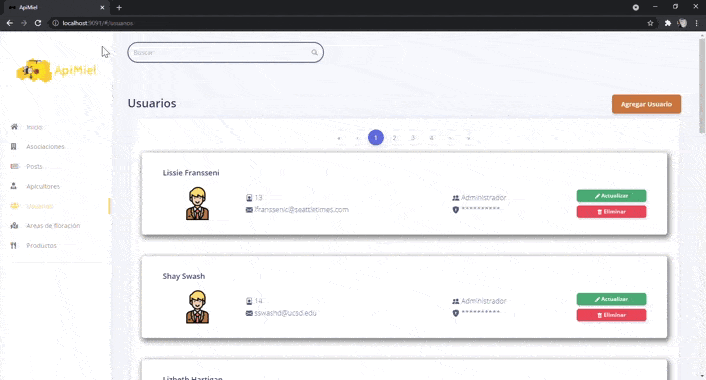

# **Sistema ApiMiel**

Se necesita tener los siguientes programas en el equipo:
```
Node js versión: 14.17.3 LTS
@vue/cli versión: 4.5.13
```




# **Ejecución**
Se descarga el proyecto, se abre en el entorno que se use por defecto en local y para empezar a correrlo se ejecutan los siguientes comandos:
```
npm install
npm run serve

```
El primer comando instalará todas las dependencias que utiliza el proyecto y el segundo ejecutará el servidor de vue para visualizar la aplicació, el puerto
por defecto que utiliza vue es el 8080.


# Estructura del proyecto
Se toma como base el dashboard que proporciona Bootstrap-Vue en su página oficial: https://www.creative-tim.com/product/bootstrap-vue-argon-dashboard?partner=134895
Además de las carpetas y componentes que viene por defecto se agregaron carpetas y archivos que se adaptan para el sistema apimiel
```
|-- Apimiel-Vue
    |-- src
        |-- routes
        |   |-- router.js
        |   |-- routes.js
        |   |-- starterRouter.js
        |-- util
        |   |-- throttle.js
        |-- views
            |-- MODULO_APICULTORES
              |-- AgregarAsociacion.vue
              |-- ModificarAsociacion.vue
              |-- ViewAsociacion.vue
            |-- MODULO_ASOCIACIONES
              |-- AgregarAsociacion.vue
              |-- ModificarAsociacion.vue
              |-- ViewAsociacion.vue
            |-- MODULO_FLORACIONES
              |-- AgregarAreaFloracion.vue
              |-- ModificarAreaFloracion.vue
              |-- ViewFloraciones.vue
            |-- MODULO_LOGIN
              |-- ViewLogin.vue
            |-- MODULO_POSTS
              |-- AgregarPost.vue
              |-- ModificarPost.vue
              |-- ViewPost.vue
            |-- MODULO_PRODUCTOS
              |-- AgregarProducto.vue
              |-- ModificarProducto.vue
              |-- ViewProducto.vue
            |-- MODULO_USUARIOS
              |-- AgregarUsuario.vue
              |-- ModificarUsuario.vue
              |-- ViewUsuario.vue
```


## Navegadores donde se ejecuta

At present, we officially aim to support the last two versions of the following browsers:

    


## Recursos del dashboard base
- Dashboard base: <https://demos.creative-tim.com/bootstrap-vue-argon-dashboard/#/dashboard?ref=bvad-github-readme>
- Página de descarga: <https://www.creative-tim.com/product/bootstrap-vue-argon-dashboard?ref=bvad-github-readme>
- Documentación: <https://www.creative-tim.com/learning-lab/bootstrap-vue/colors/argon-dashboard?ref=bvad-github-readme>
- Acuerdo de licencia: <https://www.creative-tim.com/license?ref=bvad-github-readme>
- Soporte: <https://www.creative-tim.com/contact-us?ref=bvad-github-readme>
- Repositorio en github: [Github Issues Page](https://github.com/creativetimofficial/bootstrap-vue-argon-dashboard/issues?ref=bvad-github-readme)


